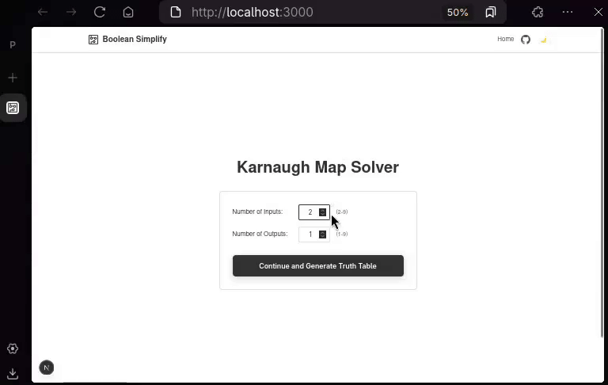

# Boolean Simplify

### Boolean Equation Generator

A web application built with Next.js for converting truth tables into boolean equations. It uses Karnaugh Map to generate the equation.

## Deployment Link

<a href="https://boolean-simplify.vercel.app/"></a> [Click here to visit the deployed application](https://boolean-simplify.vercel.app/)

[](https://github.com/abrarshakhi/boolean-simplify)
[](https://github.com/abrarshakhi/boolean-simplify/issues)
[](https://github.com/abrarshakhi/boolean-simplify/blob/main/LICENSE)
[](https://boolean-simplify.vercel.app/)
[](https://github.com/abrarshakhi/boolean-simplify/graphs/contributors)

## Demo

Here's a quick demonstration of how Boolean Simplify works:



## Features

- Convert truth tables to boolean equations using Karnaugh Map method
- Support for multiple input and output variables
- Real-time equation generation
- Dark and light mode themes
- User-friendly interface
- Responsive design for all devices

## Built With


## Getting Started

### Prerequisites

- Node.js (version 18 or newer)
- Yarn
- TypeScript

### Quick Example

1. Input your truth table:
   - For a 2-input, 1-output system:
   ```
   A B | Y
   0 0 | 1
   0 1 | 0
   1 0 | 1
   1 1 | 1
   ```
2. Click "Generate" to get the simplified boolean equation
3. The result will be: `Y = A + B'`

### Setup Instructions

1. Clone the repository:

```bash
git clone https://github.com/yourusername/boolean-simplify.git
cd boolean-simplify
```

2. Install dependencies:

```bash
yarn install
```

3. Start the development server:

```bash
yarn dev
```

4. Access the application at [http://localhost:3000](http://localhost:3000)

## Usage

1. Specify the number of inputs and outputs
2. Fill in the truth table values
3. Click generate to compute the boolean equation
4. Copy the generated equation as needed

## Contributing

We welcome contributions to improve this project. Please follow these steps:

1. Fork the repository
2. Create a feature branch (`git checkout -b feature/YourFeature`)
3. Commit your changes (`git commit -m 'Add YourFeature'`)
4. Push to the branch (`git push origin feature/YourFeature`)
5. Open a Pull Request

## License

This project is licensed under the Apache License 2.0 - which means you can use, modify, and distribute it, but you need to include the original copyright notice and state significant changes. Check out the [LICENSE](LICENSE) file for all the legal details.
